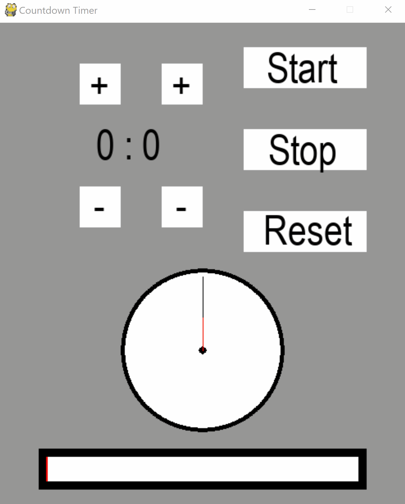

# CountDown Timer
This is a small personal project that I created mainly just to applied the self-learning Python knowledge along with some basic trigonometry concepts. This program lets you enter the amount of time and then a clock counts down from the input time to 00:00. When the time is up,  my favorite song is played a sound to signal that. While the clock is counting down, you can pause the time and resume it, stop the time (and go back to the input) or restart the clock.

* Note: Press any button to stop the alarm sound. Otherwise, it will not stop until reaching the end of the sound file.

# Demo
* Note: Unfortunately, the demo does not have sound effect

